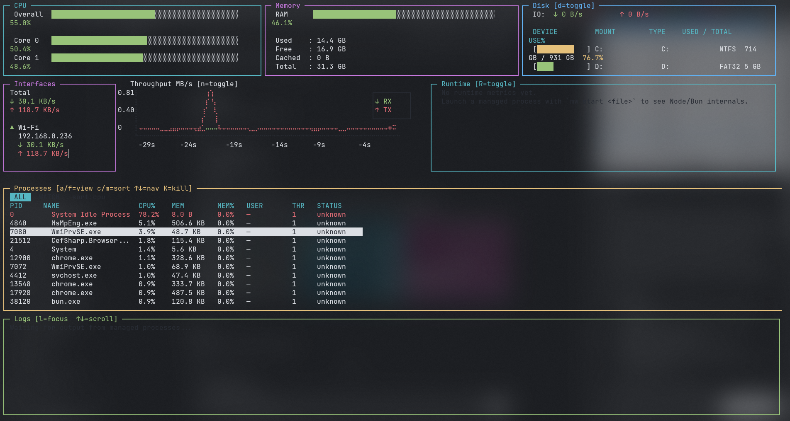

# MetWatch

[](https://www.npmjs.com/package/metwatch)
[](./LICENSE)
[](https://bun.sh)
[](#requirements)
[](https://github.com/victorhhh/metwatch/pulls)

**MetWatch** is a terminal-based (TUI) process monitoring and management tool — like `htop` and PM2 combined in a single dashboard. It gives you realtime CPU, memory, disk, and network metrics alongside a full process table and managed process lifecycle (start / restart / stop / logs) without leaving your terminal.



---

## Features

- **CPU panel** — overall usage percentage + per-core bars, color-coded by load
- **Memory panel** — RAM used / free / cached / total with visual gauge
- **Disk panel** — per-mount usage bars with read/write IO rates
- **Network panel** — realtime RX/TX throughput sparkline (last 60 s) + per-interface stats
- **Process table** — all system processes sorted by CPU or memory; dual-mode (All / Watched); viewport-capped (no terminal scroll)
- **Managed processes** — launch scripts with `mw start`, get auto-restart with exponential back-off
- **Runtime metrics** — Node.js / Bun heap, RSS, event-loop lag and GC stats via Chrome DevTools Protocol
- **Log streaming** — stdout/stderr of managed processes buffered and displayed in the Logs panel
- **Collapsible panels** — toggle any panel on/off with a single key to reclaim screen space
- **Config file** — define watched processes and refresh interval in `metwatch.config.json`

---

## Requirements

| Requirement | Version |
|---|---|
| [Bun](https://bun.sh) | ≥ 1.0.0 |
| Terminal | Real TTY required (does not work piped) |
| OS | macOS, Linux, Windows |

Install Bun if you haven't already:

```bash
curl -fsSL https://bun.sh/install | bash
```

---

## Installation

### Global install (recommended)

```bash
bun add -g metwatch
```

Then run from anywhere:

```bash
mw
```

### Run without installing

```bash
bunx metwatch
```

### From source

```bash
git clone https://github.com/victorhhh/metwatch.git
cd metwatch
bun install
bun run start
```

---

## Quick Start

```bash
# Open the live dashboard (monitor all system processes)
mw

# Launch a TypeScript server and watch it in the dashboard
mw start server.ts

# Launch a Python script, give it a name, and disable auto-restart
mw start app.py --name api --no-restart

# Launch a Node.js worker with a custom env variable
mw start worker.js --env PORT=4000
```

---

## Usage

### `mw monitor`

Open the TUI dashboard without launching any managed process. Useful when you just want to observe system metrics.

```bash
mw monitor
mw            # same — monitor is the default command
```

---

### `mw start <file>`

Launch a script as a MetWatch-managed process and open the TUI dashboard. The runtime is inferred from the file extension:

| Extension | Runtime |
|---|---|
| `.ts` / `.tsx` | `bun` |
| `.js` / `.mjs` / `.cjs` | `node` |
| `.py` | `python` |
| other | executed directly |

```bash
mw start <file> [options]
```

**Options:**

| Flag | Description | Default |
|---|---|---|
| `--name <label>` | Display name in the TUI | basename of `<file>` |
| `--runtime <cmd>` | Override the inferred runtime | auto-detected |
| `--no-restart` | Disable auto-restart on crash | auto-restart enabled |
| `--cwd <dir>` | Working directory for the child process | `process.cwd()` |
| `--env KEY=VALUE` | Set an environment variable (repeatable) | — |

**Examples:**

```bash
# Run a Bun TypeScript server
mw start server.ts

# Run a Python API with a custom name
mw start app.py --name api

# Run a Node.js worker in a subdirectory with an env var
mw start worker.js --cwd ./workers --env PORT=4000 --env NODE_ENV=production

# Run a binary directly without auto-restart
mw start ./dist/server --no-restart

# Override the runtime explicitly
mw start main.ts --runtime tsx
```

---

### `mw list`

Print the current state of all managed processes to stdout.

```bash
mw list
```

**Example output:**

```
NAME     PID    STATUS    RESTARTS  UPTIME
api      12345  running   0         2m 34s
worker   12346  stopped   2         —
```

---

### `mw logs <name>`

Print buffered stdout/stderr for a managed process.

```bash
mw logs <name> [options]
```

**Options:**

| Flag | Description | Default |
|---|---|---|
| `--follow`, `-f` | Tail live output (Ctrl+C to exit) | off |
| `--lines <n>` | Number of lines to show | 50 |

**Examples:**

```bash
# Show last 50 lines of logs for "api"
mw logs api

# Tail live logs
mw logs api --follow

# Show last 200 lines
mw logs api --lines 200
```

---

### `mw stop <name|all>`

Gracefully stop a managed process with `SIGTERM`.

```bash
mw stop <name>   # stop a specific process
mw stop all      # stop every managed process
```

**Examples:**

```bash
mw stop api
mw stop all
```

---

## Configuration

MetWatch reads `metwatch.config.json` from the current working directory at startup. If the file is not found, built-in defaults are used. Bad JSON falls back to defaults without crashing.

```json
{
  "watchedProcesses": [
    { "name": "node",   "label": "Node Apps" },
    { "name": "bun",    "label": "Bun Apps"  },
    { "name": "python", "label": "Python"    }
  ],
  "refreshInterval": 1000,
  "maxProcesses": 50
}
```

**Fields:**

| Field | Type | Default | Description |
|---|---|---|---|
| `watchedProcesses` | `array` | `[]` | Processes to highlight in Watched mode |
| `watchedProcesses[].name` | `string` | — | Substring matched against process name (case-insensitive) |
| `watchedProcesses[].label` | `string` | same as `name` | Display label in the Watched view |
| `refreshInterval` | `number` (ms) | `1000` | Poll interval — minimum `250` ms |
| `maxProcesses` | `number` | `50` | Max processes shown in the All view (sorted by CPU desc) |

---

## Dashboard Panels

| Panel | Toggle key | What it shows |
|---|---|---|
| **CPU** | always on | Overall CPU% + per-core bars colored by load |
| **Memory** | always on | RAM used / free / cached / total with gauge |
| **Disk** | `d` | Per-mount usage bars + read/write IO rates (MB/s) |
| **Network** | `n` | Per-interface RX/TX rates + 60-second throughput sparkline |
| **Runtime** | `R` | Heap, RSS, event-loop lag, GC stats for managed processes |
| **Processes** | `p` | Scrollable process table — All or Watched mode |
| **Logs** | `l` (focus) | Buffered stdout/stderr of managed processes |

---

## Keyboard Shortcuts

### Global

| Key | Action |
|---|---|
| `q` / `Ctrl+C` | Quit MetWatch |
| `?` | Toggle keybindings help overlay |

### Panel toggles

| Key | Action |
|---|---|
| `d` | Toggle Disk panel |
| `n` | Toggle Network panel |
| `R` | Toggle Runtime panel |
| `p` | Toggle Process panel |
| `l` | Focus / toggle Logs panel |

### Process table

| Key | Action |
|---|---|
| `a` | All processes mode |
| `f` | Watched processes mode (from config) |
| `c` | Sort by CPU usage |
| `m` | Sort by memory usage |
| `↑` / `k` | Move selection up |
| `↓` / `j` | Move selection down |
| `K` (Shift+k) | Kill selected process (confirm dialog) |
| `r` | Restart selected managed process |
| `s` | Stop selected managed process |

---

## Contributing

Contributions are welcome! Here is how to get started:

1. **Fork** the repository on GitHub
2. **Clone** your fork: `git clone https://github.com/<your-username>/metwatch.git`
3. **Create a branch**: `git checkout -b feat/my-feature`
4. **Install dependencies**: `bun install`
5. **Make your changes** following the conventions below
6. **Typecheck**: `bun run typecheck` — must exit with 0 errors before opening a PR
7. **Open a Pull Request** against `main` on [victorhhh/metwatch](https://github.com/victorhhh/metwatch/pulls)

> **Note:** All pull requests are reviewed and merged exclusively by the maintainer ([@elhuguito](https://github.com/victorhhh)). Submitting a PR does not guarantee acceptance, but all contributions are genuinely appreciated and reviewed.

### Code conventions (summary)

- **TypeScript strict mode** — no `any`, no `@ts-ignore` without a comment
- **Factory functions** over classes — managers use `create*()` returning plain objects
- **React components** — widgets are `.tsx` files using `useState`/`useEffect` hooks; `useInput` for keyboard handling
- **Event bus** — every `bus.on()` must store and call its unsubscribe in the `useEffect` cleanup
- **Layer rules** — widgets never import from `services/` directly; all data via bus + state
- **No `.then()` chains** — use `async/await` everywhere

For a full architecture guide, see [AGENTS.md](./AGENTS.md).

### Reporting issues

Please open an issue at [github.com/victorhhh/metwatch/issues](https://github.com/victorhhh/metwatch/issues) with:
- OS and terminal emulator
- Bun version (`bun --version`)
- Steps to reproduce
- Screenshot or error output if applicable

---

## License

MIT © 2026 [elhuguito](https://github.com/victorhhh)

See [LICENSE](./LICENSE) for the full text.
